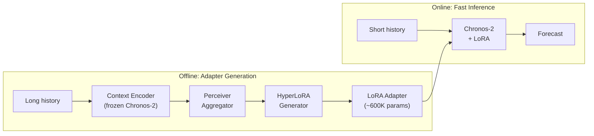
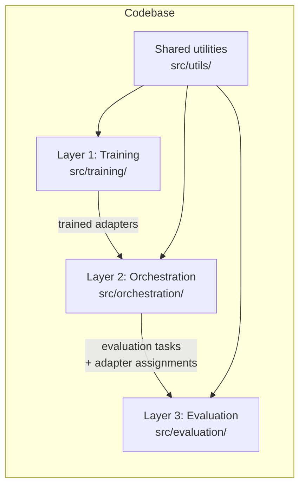

# Distilling Context into Parameters for Chronos-2

> DTU 42578 Advanced Business Analytics

Time-series foundation models like Chronos-2 deliver strong zero-shot forecasts but need long context windows at inference, which means high memory usage and slow predictions. This project asks: **can we compress that long history into a tiny set of model parameters instead?**

We adapt the [Doc-to-LoRA](https://arxiv.org/abs/2602.15902) framework — originally designed for LLMs — to work with the [Chronos-2](https://github.com/amazon-science/chronos-forecasting) time-series model. A hypernetwork reads a long traffic history and produces a lightweight LoRA adapter in a single forward pass. At inference time, Chronos-2 can then forecast accurately using only a short context window plus the generated adapter.

## The idea

Chronos-2 normally needs a large chunk of recent history (the "context window") to make good predictions. Our approach splits the work into two stages:

1. **Offline** — A hypernetwork reads the full history and distills it into a small LoRA adapter (~600K parameters).
2. **Online** — Chronos-2 runs with a much shorter context window plus the adapter, producing forecasts that match (or beat) the full-context baseline.

The adapter is trained via knowledge distillation: a teacher (Chronos-2 with full context) guides a student (Chronos-2 with short context + LoRA) by minimizing the KL divergence between their output distributions.



## Research questions

1. **Context compression** — Can we preserve forecasting quality while significantly reducing inference time and memory?
2. **Transfer learning** — Does a hypernetwork trained on a subset of stations generalize to unseen stations?
3. **Beyond the teacher** — Can the student outperform the teacher, e.g. by filtering noise in the history?

## Data

We use the **PEMS-BAY** traffic speed dataset (325 sensors, 5-minute granularity, ~6 months) from the California Department of Transportation, following the benchmark in [Pulido & Rodrigues, 2026](https://arxiv.org/abs/2602.24238).

## Project structure



| Layer | Purpose | Location |
|-------|---------|----------|
| **Training** | Trains the hypernetwork that produces LoRA adapters | `src/training/` |
| **Orchestration** | Runs experiments end-to-end, prepares evaluation inputs | `src/orchestration/` |
| **Evaluation** | Loads Chronos-2, applies adapters, computes metrics & runtime stats | `src/evaluation/` |
| **Utilities** | Data loading, metrics (MAE, MAPE, RMSE, coverage), shared helpers | `src/utils/` |

Configuration is managed with [Hydra](https://hydra.cc/) under the `conf/` directory.

For implementation details see [IMPLEMENTATION_PLAN.md](IMPLEMENTATION_PLAN.md) and [SOLUTION_DESIGN.md](SOLUTION_DESIGN.md).

## How to run

**1. Setup environment**:
```bash
uv sync
```

**2. Download data**:
- Download [PEMS-BAY dataset](https://mega.nz/file/dN5VQaob#m9E9WQbgtwYFIWveEmFQPI8I9Z_spBJkZW7LT2GGuGE)
- Unzip
- Place `pems-bay.h5` in root folder `data`

**3. Run baseline evaluation**:
```bash
uv run python -m src.evaluation.main --config-name experiment_baseline dataset_cfg=dataset/PEMS-BAY
```

## AI Agents
Note for AI Agents: Please read AGENTS.md before suggesting any code changes to understand the architectural patterns and state management used in this project.
